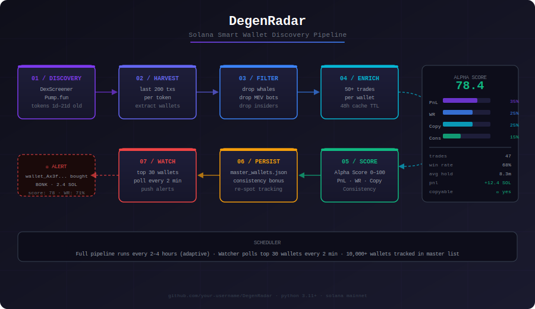
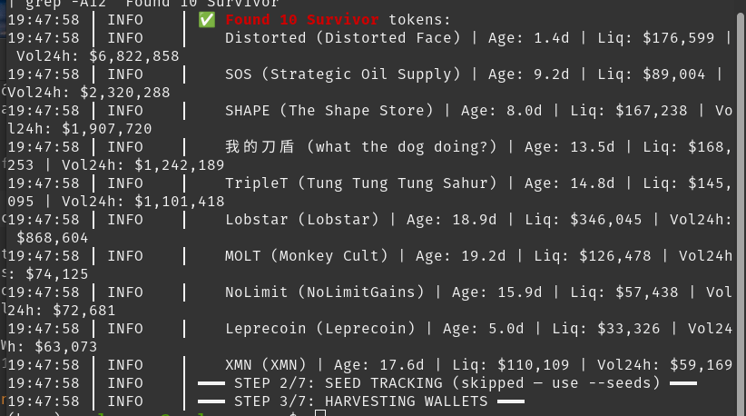
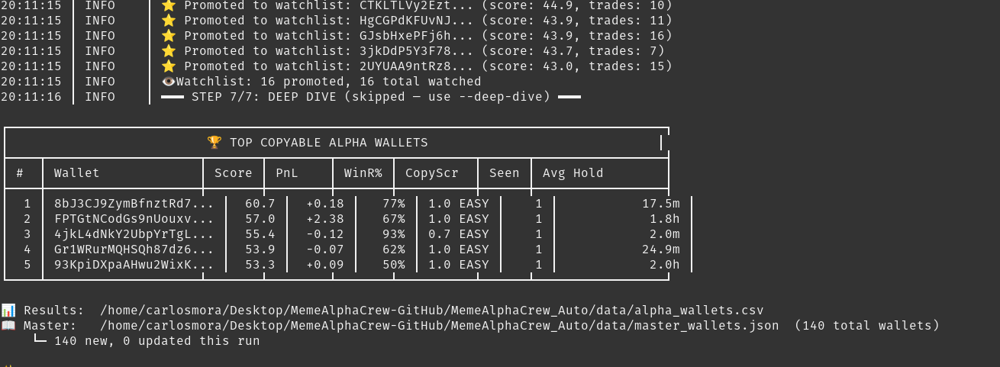

# DegenRadar — Solana Smart Wallet Discovery

[English](#english) | [Español](#español)

---

## English



Finding consistently profitable meme coin traders on Solana is nearly impossible to do manually — the volume of wallets and transactions is just too high. DegenRadar automates that process.

It scans token activity on DexScreener and Pump.fun, extracts the wallets behind successful trades, filters out whales/MEV bots/insiders, and scores each wallet based on real performance metrics. The best wallets get promoted to a live watchlist that gets polled every 2 minutes — so when they make a move, you know about it.

### How it works

**Discovery → Filter → Score → Watch**

1. **Discovery** — Scans DexScreener and Pump.fun for tokens with real traction (age, liquidity, volume filters)
2. **Seed Tracking** — Optionally monitors a set of known "good" wallets to find tokens early
3. **Harvest** — Pulls all wallet addresses that traded each token (last 200 transactions)
4. **Filter** — Drops whales (>25 SOL avg buy), MEV bots (<2s holds), and single-token insiders
5. **Enrich** — Fetches 50+ trades of history per wallet for better signal
6. **Score** — Ranks wallets 0–100 using PnL (35%), Win Rate (25%), Copyability (25%), Consistency (15%)
7. **Watch** — Top 30 wallets get real-time monitoring with push alerts on new activity

The scheduler runs the full pipeline every 2–4 hours (adaptive — backs off when nothing new is found) and logs everything with rotating file handlers.

### Scoring

The Alpha Score isn't just raw PnL. A wallet that made 10 SOL on one lucky trade ranks lower than one with 40+ trades, 65% win rate, and consistent 5–30 minute hold times. Confidence multipliers penalize small samples hard — fewer than 5 trades caps the score at 35/100.

Copyability is a key metric: MEV bots (sub-5s holds) score 0.0, fast snipers score 0.3, human-paced traders (5m+ holds) score 1.0. No point tracking a wallet you can't follow.

### Stack

- Python 3.11+
- Solana (`solana-py`, `solders`)
- DexScreener + Pump.fun APIs
- Multi-node RPC rotation (Helius, Alchemy, QuickNode, public fallbacks)
- JSON-based persistence — no database needed

### Output




### Setup

```bash
git clone https://github.com/carlosmmora26/DegenRadar.git
cd DegenRadar
pip install -r requirements.txt
cp MemeAlphaCrew_Auto/.env.example MemeAlphaCrew_Auto/.env
# Add your RPC URLs to .env
```

**Run the discovery pipeline:**
```bash
python3 -m MemeAlphaCrew_Auto.main --seeds --deep-dive --top 20
```

**Run 24/7 with scheduler:**
```bash
python3 -m MemeAlphaCrew_Auto.auto_scheduler
```

**Run the real-time watcher:**
```bash
python3 -m MemeAlphaCrew_Auto.watcher
```

---

## Español

Encontrar traders de memecoins en Solana que ganen de forma consistente es casi imposible de hacer a mano — el volumen de wallets y transacciones es demasiado alto. DegenRadar automatiza ese proceso.

Escanea actividad de tokens en DexScreener y Pump.fun, extrae las wallets detrás de los trades exitosos, filtra whales/bots MEV/insiders, y puntúa cada wallet según métricas reales de rendimiento. Las mejores wallets se promueven a una watchlist que se consulta cada 2 minutos — así que cuando hacen un movimiento, te enteras.

### Cómo funciona

**Descubrimiento → Filtrado → Puntuación → Monitoreo**

1. **Discovery** — Escanea DexScreener y Pump.fun buscando tokens con tracción real (filtros de edad, liquidez, volumen)
2. **Seed Tracking** — Opcionalmente monitorea wallets "buenas" conocidas para encontrar tokens temprano
3. **Harvest** — Extrae todas las wallets que transaccionaron cada token (últimas 200 transacciones)
4. **Filter** — Elimina whales (>25 SOL promedio de compra), bots MEV (holds <2s) e insiders de un solo token
5. **Enrich** — Obtiene 50+ trades de historial por wallet para mejor señal
6. **Score** — Puntúa wallets de 0–100 usando PnL (35%), Tasa de Victoria (25%), Copyabilidad (25%), Consistencia (15%)
7. **Watch** — Las top 30 wallets se monitorean en tiempo real con alertas cuando hacen un movimiento

El scheduler corre el pipeline completo cada 2–4 horas (adaptativo — reduce frecuencia cuando no encuentra nada nuevo) y registra todo con logs rotativos.

### Puntuación

El Alpha Score no es solo PnL bruto. Una wallet que ganó 10 SOL en un trade de suerte rankea más bajo que una con 40+ trades, 65% de win rate y hold times consistentes de 5–30 minutos. Los multiplicadores de confianza penalizan fuerte las muestras pequeñas — menos de 5 trades topa el score en 35/100.

La Copyabilidad es una métrica clave: bots MEV (holds <5s) puntúan 0.0, snipers rápidos 0.3, traders al ritmo humano (5m+ de hold) puntúan 1.0. No tiene sentido seguir una wallet que no puedes copiar.

### Stack

- Python 3.11+
- Solana (`solana-py`, `solders`)
- APIs de DexScreener y Pump.fun
- Rotación multi-nodo de RPC (Helius, Alchemy, QuickNode, fallbacks públicos)
- Persistencia en JSON — sin base de datos externa necesaria

### Instalación

```bash
git clone https://github.com/carlosmmora26/DegenRadar.git
cd DegenRadar
pip install -r requirements.txt
cp MemeAlphaCrew_Auto/.env.example MemeAlphaCrew_Auto/.env
# Agrega tus RPC URLs al .env
```

**Correr el pipeline de descubrimiento:**
```bash
python3 -m MemeAlphaCrew_Auto.main --seeds --deep-dive --top 20
```

**Correr 24/7 con scheduler:**
```bash
python3 -m MemeAlphaCrew_Auto.auto_scheduler
```

**Correr el watcher en tiempo real:**
```bash
python3 -m MemeAlphaCrew_Auto.watcher
```

---

*Disclaimer: Este proyecto es con fines educativos. Trading de memecoins conlleva alto riesgo. Úsalo bajo tu propio criterio.*
